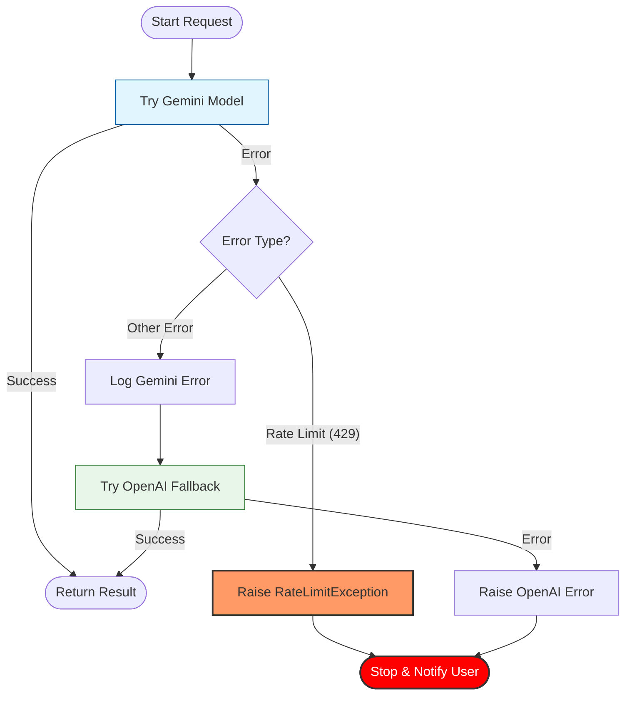

# LLM Fallback & Retry Logic

This diagram illustrates the current logic for LLM model selection and error handling, including the new "Fail Fast" mechanism for rate limits.

## Key behaviors:
1.  **Primary**: Gemini is always attempted first.
2.  **Fail Fast**: If a **Rate Limit** (429) is encountered, the system **immediately stops** and propagates the error to the user. It does *not* try OpenAI, avoiding further delays or confusion.
3.  **Fallback**: For other errors (e.g., API downtime, bad request), it attempts to fall back to OpenAI.
