# Architecture Diagrams & Flow Charts

## 1. Complete System Architecture

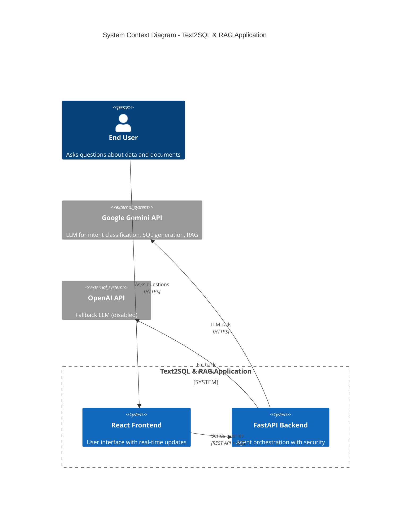

## 2. Agent State Machine

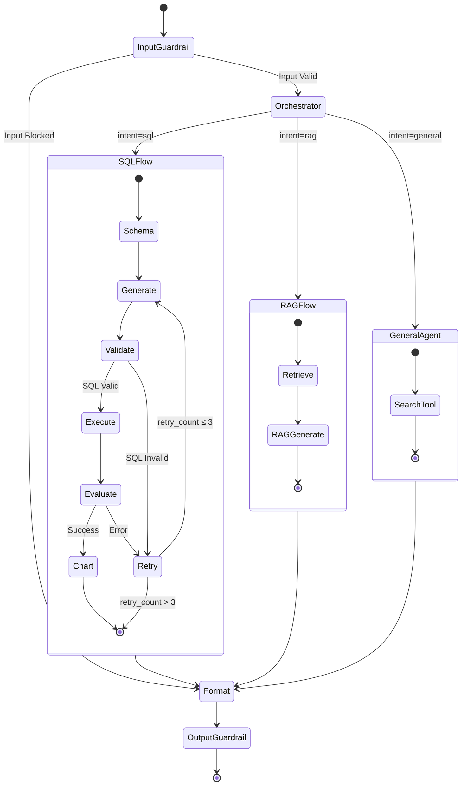

## 3. SQL Pipeline Detailed Flow

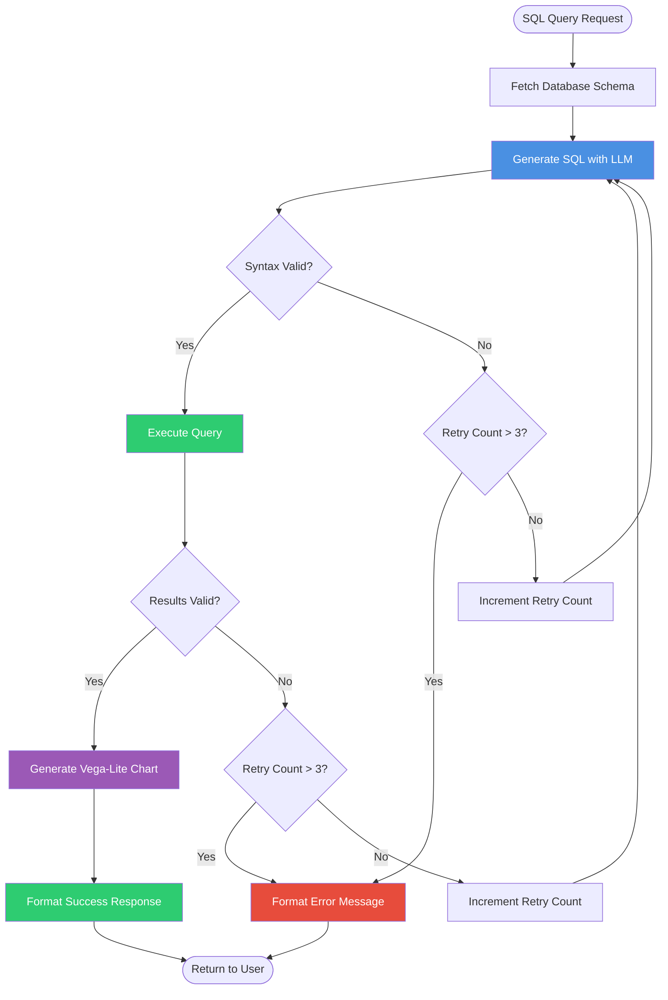

## 4. RAG Pipeline Detailed Flow

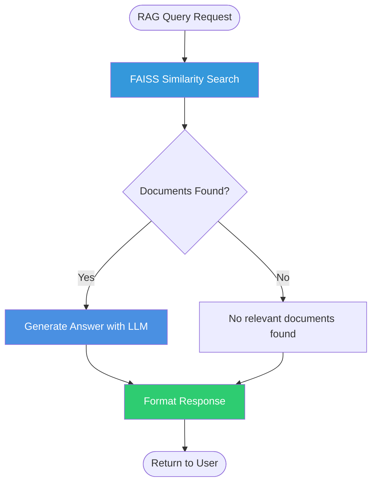

## 5. PII Scrubbing Flow

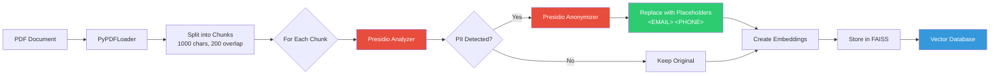

## 6. Guardrails Validation Flow

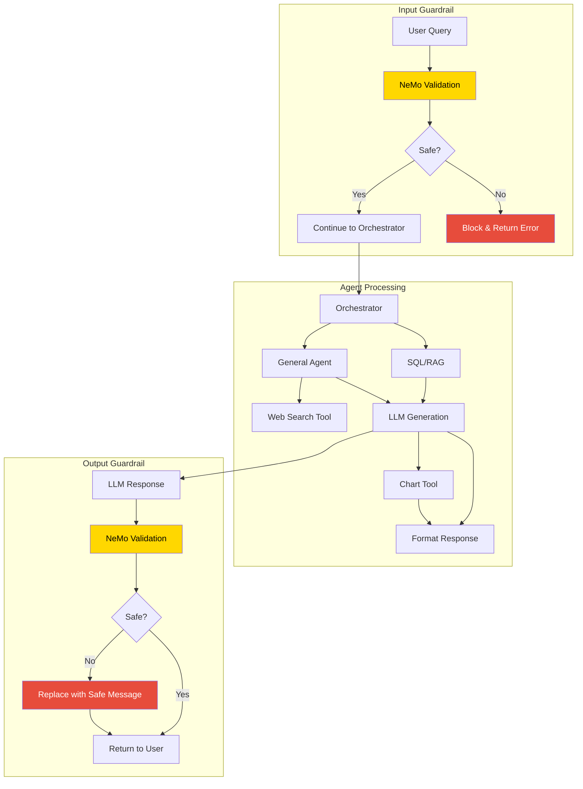

## 7. LLM Invocation with Fallback

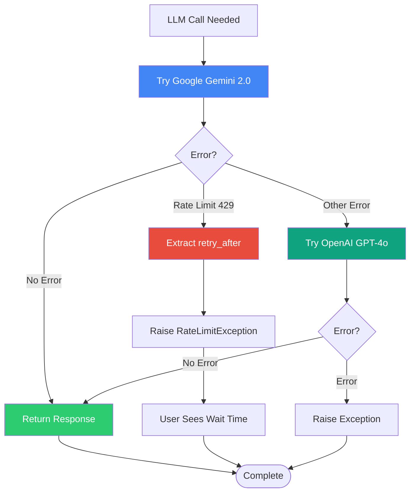

## 8. Database Schema ER Diagram

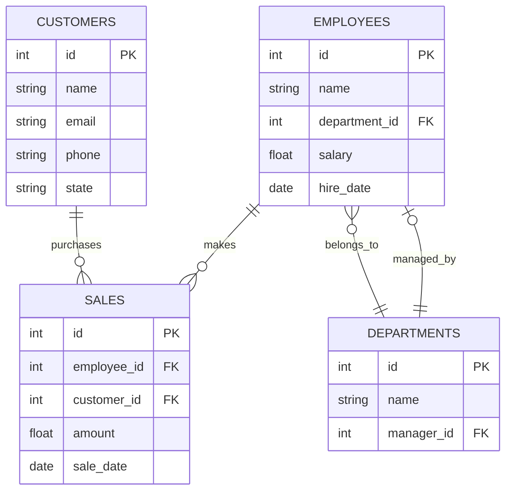

## 9. Frontend Component Hierarchy

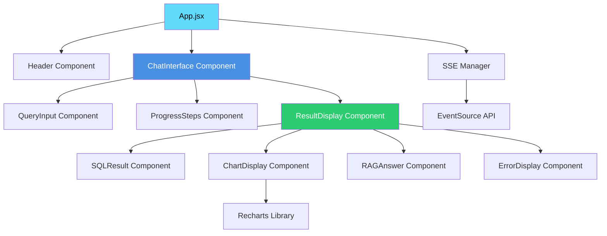

## 10. Deployment Architecture

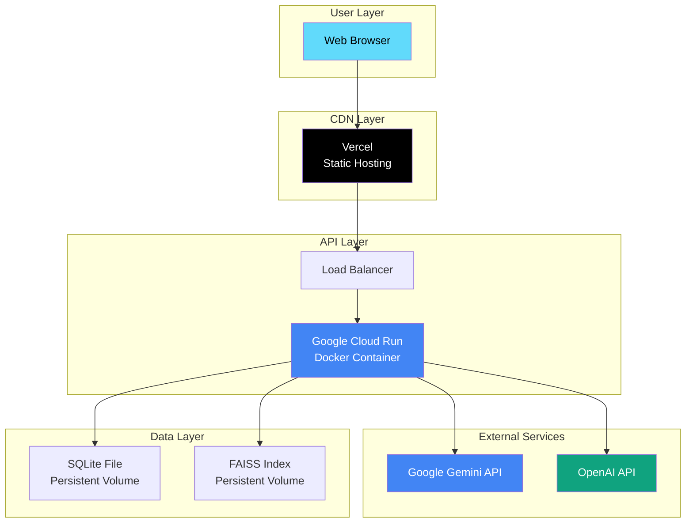

## 11. Error Handling Flow

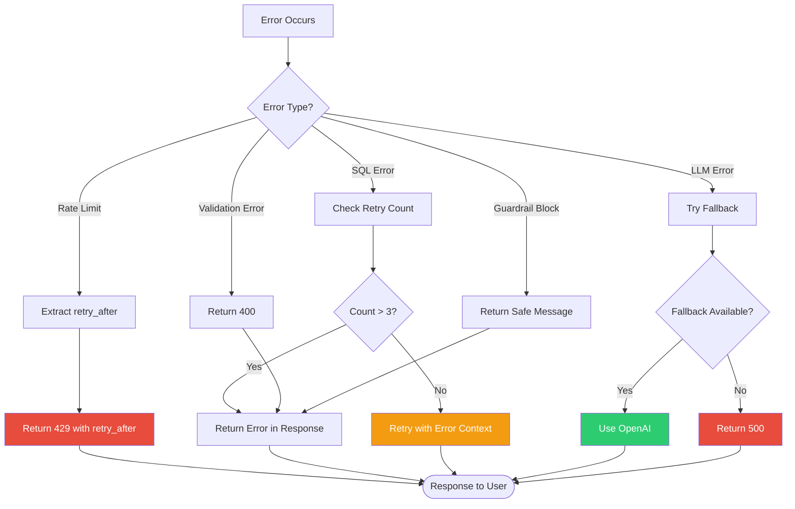

## 12. SSE (Server-Sent Events) Flow

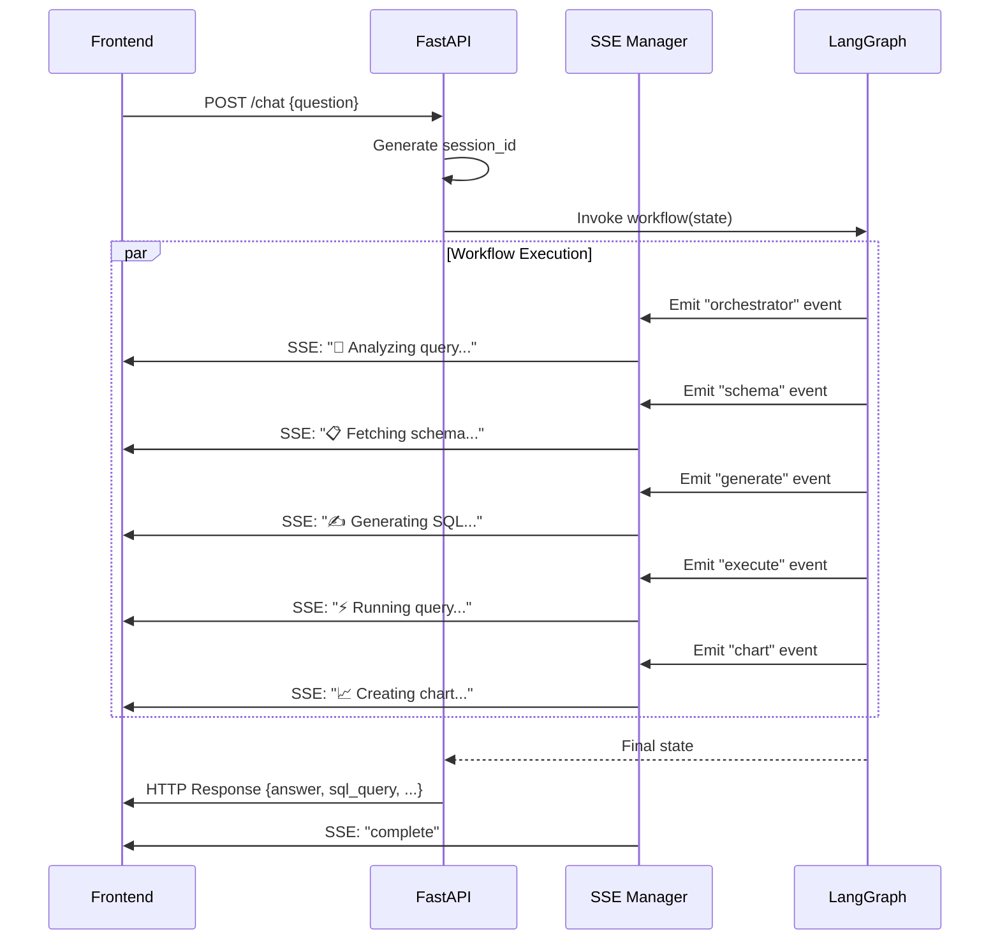

## 13. Security Layers

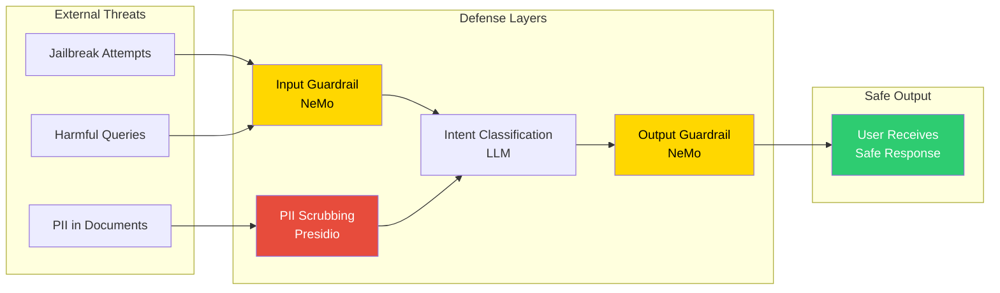
