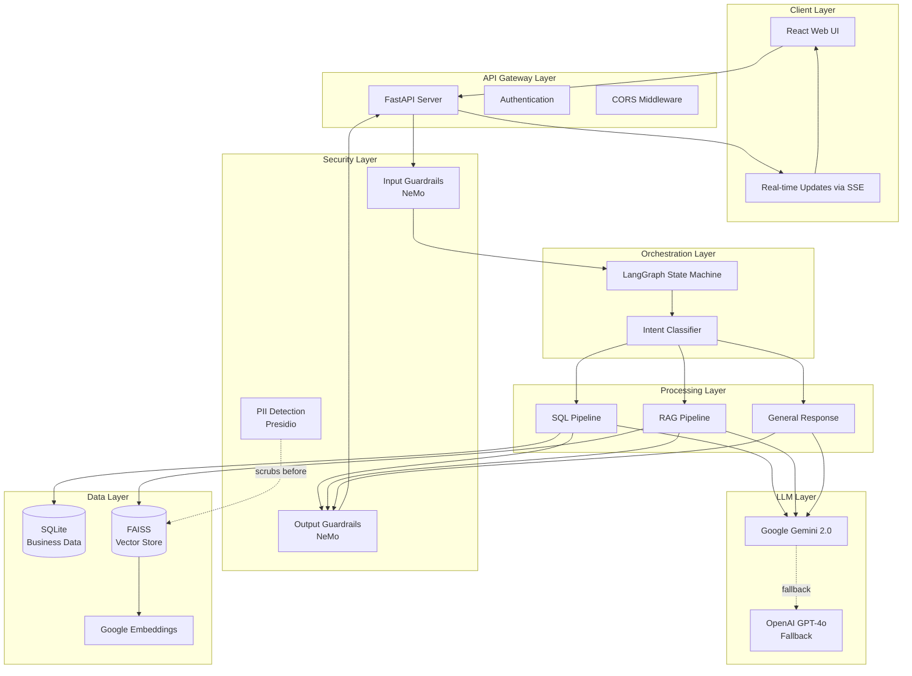
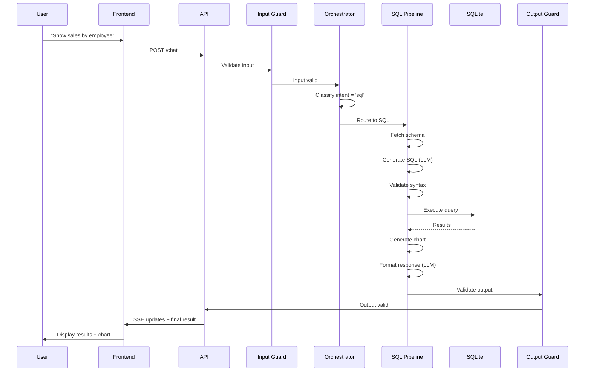
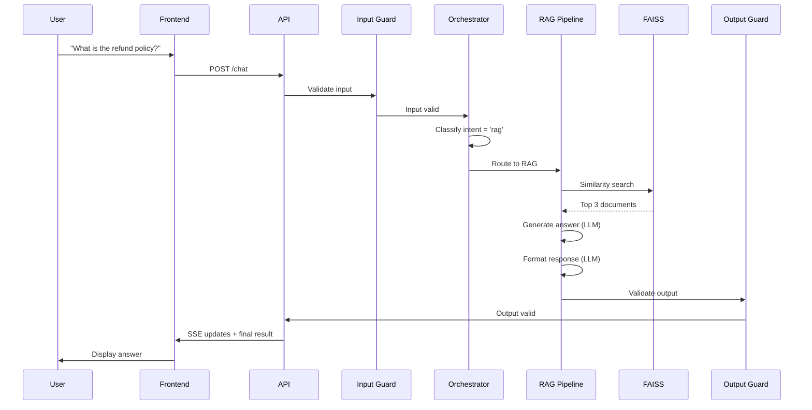

# High-Level Design (HLD) - Text2SQL & RAG Application

## 1. System Overview

The application is an intelligent agent-based system that processes natural language queries and routes them to appropriate handlers (SQL generation or document retrieval) with built-in security guardrails and PII protection.

### 1.1 Key Components



## 2. Architecture Principles

### 2.1 Design Patterns
- **State Machine Pattern**: LangGraph manages agent flow
- **Strategy Pattern**: Different handlers for SQL/RAG/General
- **Chain of Responsibility**: Guardrails → Orchestrator → Handlers
- **Retry Pattern**: Automatic retry with exponential backoff for SQL generation
- **Observer Pattern**: SSE for real-time progress updates

### 2.2 Security-First Design
- **Defense in Depth**: Multiple security layers (input/output guardrails, PII scrubbing)
- **Fail-Safe Defaults**: Guardrails fail-open to maintain availability
- **Least Privilege**: Minimal data exposure through PII anonymization

## 3. Component Responsibilities

### 3.1 Frontend (React)
**Responsibility**: User interface and real-time updates

**Key Features**:
- Natural language query input
- Real-time agent step visualization via SSE
- SQL result display with charts (Recharts)
- RAG answer rendering
- Error handling and user feedback

**Technology Stack**:
- React 18 + Vite
- TailwindCSS for styling
- Recharts for visualization
- EventSource API for SSE

### 3.2 API Gateway (FastAPI)
**Responsibility**: HTTP request handling and routing

**Endpoints**:
- `POST /chat` - Main chat endpoint
- `GET /sse/{session_id}` - Server-Sent Events stream
- `GET /health` - Health check

**Features**:
- CORS middleware for cross-origin requests
- Session management
- Error handling and logging
- OpenTelemetry instrumentation

### 3.3 Security Layer

#### Input Guardrails (NeMo)
**Responsibility**: Validate user inputs before processing

**Checks**:
- Jailbreak attempt detection
- Content moderation (inappropriate/harmful content)
- Topic adherence (SQL/document-related queries)

**Flow**:
```
User Input → NeMo Validation → [PASS: Continue] or [BLOCK: Return error]
```

#### Output Guardrails (NeMo)
**Responsibility**: Validate LLM responses before returning to user

**Checks**:
- Harmful content detection
- Inappropriate response filtering
- Safety compliance

**Flow**:
```
LLM Response → NeMo Validation → [PASS: Return] or [BLOCK: Replace with safe message]
```

#### PII Detection (Presidio)
**Responsibility**: Anonymize sensitive data before storage

**Detected Entities**:
- Email addresses, phone numbers
- SSNs, credit cards, passports
- Names, locations, dates
- IP addresses, URLs

**Flow**:
```
PDF Document → Split → PII Scrubber → Anonymized Text → Embeddings → FAISS
```

### 3.4 Orchestration Layer (LangGraph)

**Responsibility**: Route queries to appropriate handlers

**State Machine**:
- Entry: Input Guardrail
- Decision: Orchestrator (LLM-based intent classification)
- Routes: SQL / RAG / General
- Exit: Output Guardrail

**State Management**:
- Shared `AgentState` TypedDict
- Immutable state updates
- Conditional routing based on state

### 3.5 Processing Pipelines

#### SQL Pipeline
**Steps**:
1. **Schema Fetcher** - Retrieves database schema
2. **SQL Generator** (LLM) - Converts NL to SQL
3. **Validator** - Checks SQL syntax
4. **Executor** - Runs query against SQLite
5. **Evaluator** - Validates results
6. **Chart Generator** - Creates Vega-Lite spec
7. **Formatter** (LLM) - Natural language response

**Retry Logic**:
- Max 3 retries on validation/execution errors
- Error context passed to LLM for correction

#### RAG Pipeline
**Steps**:
1. **Retriever** - FAISS similarity search (k=3)
2. **RAG Generator** (LLM) - Answer from context
3. **Formatter** (LLM) - Natural language response

#### General Pipeline
**Steps**:
1. **Formatter** (LLM) - Direct response generation

### 3.6 LLM Layer

**Primary**: Google Gemini 2.0 Flash
- Fast inference
- Cost-effective
- Good reasoning capabilities

**Fallback**: OpenAI GPT-4o-mini (currently disabled)
- Automatic fallback on Gemini failures
- Rate limit handling with fail-fast

**Usage Points**:
- Orchestrator (intent classification)
- SQL Generator (NL → SQL)
- RAG Generator (context → answer)
- Formatter (result → NL)

### 3.7 Data Layer

#### SQLite Database
**Purpose**: Business data storage

**Schema**:
- `employees` - Employee records
- `sales` - Sales transactions
- `departments` - Department info
- `customers` - Customer data

#### FAISS Vector Store
**Purpose**: Document embeddings for RAG

**Features**:
- Fast similarity search
- Local storage (no external dependencies)
- Google text-embedding-004 model

**Ingestion Process**:
```
PDF → Load → Split (1000 chars, 200 overlap) → PII Scrub → Embed → Store
```

## 4. Data Flow

### 4.1 SQL Query Flow


### 4.2 RAG Query Flow


## 5. Non-Functional Requirements

### 5.1 Performance
- **Response Time**: < 5s for SQL queries, < 3s for RAG
- **Throughput**: 10 concurrent users
- **LLM Latency**: ~1-2s per call (Gemini)

### 5.2 Scalability
- **Horizontal**: Stateless API allows multiple instances
- **Vertical**: SQLite suitable for < 100GB data
- **FAISS**: In-memory, scales to millions of vectors

### 5.3 Security
- **Input Validation**: NeMo Guardrails
- **Output Filtering**: NeMo Guardrails
- **Data Privacy**: PII scrubbing before storage
- **API Security**: CORS, rate limiting (future)

### 5.4 Reliability
- **Retry Logic**: 3 retries for SQL generation
- **Fallback LLM**: OpenAI (disabled, can be enabled)
- **Fail-Safe Guardrails**: Fail-open on initialization errors
- **Error Handling**: Graceful degradation

### 5.5 Observability
- **Tracing**: OpenTelemetry for all agent nodes
- **Logging**: Structured logs for debugging
- **Monitoring**: SSE for real-time progress
- **Metrics**: LLM call counts, latencies (future)

## 6. Deployment Architecture

### 6.1 Development
```
Frontend: localhost:5173 (Vite dev server)
Backend: localhost:8000 (Uvicorn)
Database: SQLite file (./data/business.db)
Vector Store: FAISS file (./data/faiss_index)
```

### 6.2 Production (Recommended)
```
Frontend: Vercel / Netlify (static hosting)
Backend: Docker container on Cloud Run / ECS
Database: SQLite → PostgreSQL (for multi-user)
Vector Store: FAISS → Pinecone / Weaviate (for scale)
LLM: Google Gemini API (managed)
Observability: LangSmith / Datadog
```

## 7. Technology Decisions

| Component | Technology | Rationale |
|-----------|-----------|-----------|
| Frontend Framework | React | Industry standard, rich ecosystem |
| Build Tool | Vite | Fast HMR, modern tooling |
| Styling | TailwindCSS | Utility-first, rapid development |
| Backend Framework | FastAPI | Async support, auto docs, Python |
| Agent Framework | LangGraph | State machine for agents, LangChain integration |
| Guardrails | NeMo | NVIDIA-backed, flexible configuration |
| PII Detection | Presidio | Microsoft-backed, comprehensive entity detection |
| Primary LLM | Gemini 2.0 | Fast, cost-effective, good reasoning |
| Vector DB | FAISS | Local, fast, no external dependencies |
| Business DB | SQLite | Simple, embedded, sufficient for demo |
| Embeddings | Google text-embedding-004 | High quality, cost-effective |

## 8. Future Enhancements

### 8.1 Short-term
- [ ] Add authentication (JWT)
- [ ] Implement rate limiting
- [ ] Add conversation history
- [ ] Support multi-turn conversations

### 8.2 Medium-term
- [ ] Migrate to PostgreSQL for production
- [ ] Add caching layer (Redis)
- [ ] Implement A/B testing for LLM models
- [ ] Add more chart types

### 8.3 Long-term
- [ ] Multi-database support
- [ ] Custom model fine-tuning
- [ ] Advanced analytics dashboard
- [ ] Mobile app (React Native)
